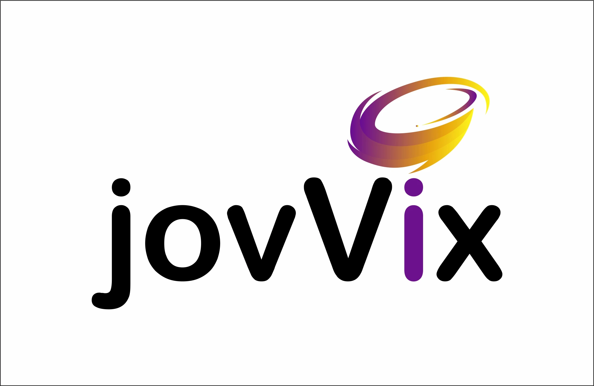

<p align="center">
  
</p>

<h3 align="center">
<b>
Open-Source Quizzing Built for Live Engagement
</b>
</h3 >


# jovVix

- jovVix is a fun and interactive platform where users can enjoy playing quizzes while admins have the ability to create engaging and diverse quizzes.
- Designed to provide a fun and educational experience while ensuring smooth admin management, jovVix is the perfect solution for interactive quiz-based learning, competitions, or corporate events.

- App is an interactive, real-time platform that supports diverse
  question types like
- App provides instant feedback and live ranks and leaderboards.
  With features like
   - In-depth analytics
   - real dynamic avatars
   - customizable csv with different question types like: Image based, code based, survey based questions
<br><br>

## Live Demo & Website

- **Website**: Visit [https://jovvix.com](https://jovvix.com) to learn more about the platform, explore the **About** section, and access full **Documentation**.
- **Live Demo**: Try out the platform live at [https://app.jovvix.com](https://app.jovvix.com) to experience how the quiz system works — including joining a quiz, answering questions in real-time, and viewing live leaderboards.

## Key Attributes:
- Cloud-Based: The application can be deployed on cloud platforms, providing high availability and scalability for users and organizations.
- Environment Agnostic: Compatible with multiple environments (local, development, staging, and production) for seamless deployment across setups.
- Cross-Platform: Designed for a smooth experience across devices and operating systems.
- Modular Architecture: Built with a component-based architecture, enabling high code reusability and scalability.
- Real-Time Features: Uses WebSockets for real-time communication and user interaction.

### Development and Quality
- Linting: Utilizes ESLint to maintain code quality and consistency.
- Authentication: Ory Kratos manages secure user authentication and session management.
- Third-Party Integrations: Includes S3 for image handling, as well as other integrations as required.
- SMTP Services: Configured for email services, supporting verification and password recovery.
- Testing: We have performed the unit testing in this application
- Containerization: Packaged with Docker for streamlined deployment and environment consistency.
- RESTful API: Offers a RESTful API for integration and easy access to app functionality.
- Environment Variables: Follows the 12-factor app principles with environment variable configuration.

### User Experience
- Intuitive UI/UX: Designed for a user-friendly and engaging interface.
- Gamification: Includes elements like points, ranks, and leaderboards to boost user engagement.

## Features

- **Real-time Interaction:** Supports real-time quizzes with instant feedback and live leaderboards, ensuring a highly engaging user experience.
- **Multiple Question Types:** Allows admins to create quizzes with different question formats:
  - Multiple-choice questions
  - Survey-based questions
  - Code-based challenges
  - Image-based questions
- **In-Depth Analytics:** Provides detailed insights and analytics for both users and admins, including answer breakdowns and performance tracking.
- **Reports-Dashboard:** Provides an in depth metrices of user's response to admin and user analysis statistics
- **Dynamic Avatars:** Real-time avatar updates for users in various stages:
  - When joining and waiting for a quiz
  - During the quiz at each question
  - After the quiz, showcasing winners and individual performance
- **Customization Options:** Offers customizable quiz features for educators, workshop hosts, and event organizers to suit their needs.
- **Share quiz feature** Users can share their quiz to other users through email and can grant their preferred permission while sharing to the other one
- **CSV Uploads:**  Enables efficient quiz creation through CSV file uploads, allowing users to preview, edit, and allowing users to seamlessly create quizzes
    - You can see the CSV formatting guidelines here : [csv-formatting-guide.md](docs/csv-formatting-guide.md)
- **Mobile-Friendly Design:** Fully responsive and works seamlessly on mobile and desktop devices.
- **Admin Tools:** Advanced admin panel for managing quizzes, participants, and results.
- **API Documentation with Swagger:** Provides a visual interface for exploring API endpoints and testing requests, Useful for developers working with the API
- **Open Source:** Fully open-source platform, allowing developers to contribute, customize, and extend the app.

## Table of Contents:

- [About jovVix](#jovvix)
  - [Quickstart](#quickstart)
- [Features](#features)
- [Getting started](#getting-started-for-local-setup-from-source)
  - [Local setup](#prerequisites-1)
- [Documentation](#architecture-overview)
  - [Architecture Overview](#architecture-overview)
  - [Overview of API documentation](#api-overview)
  - [Upgrading and changelog](#upgrading-and-changelog)
- [Contributing to jovVix](#contributing-to-jovvix)
- [Code Of Conduct](#code-of-conduct)
- [Develop]()
  - [Guide](#guide)
  - [Collaborators](#collaborators)
  - [Dependencies](#dependencies)

## Prerequisites
- Docker latest version installed in your system

## Quickstart

> **Important:**
>  Ensure all the tools mentioned in the prerequisites are installed before proceeding.


- First clone the repository on your terminal using command given below
```
  git clone https://github.com/improwised/jovVix.git
```

- Navigate to the project directory using:

```
   cd jovVix
```

- Configure your env settings into .env.docker if you want to integrate any changes otherwise keep the default ones

- Then build and run the docker compose file in your environment by following command
```
  docker-compose up --build
```

- Your app is now running successfully and you can access it on the ip:port as :
```
  127.0.0.1:5000
```
- For verification of email go to mailpit localhost and port
```
  127.0.0.1:8025
```

## Getting Started For local setup from source

### Prerequisites

| Package | Version |
| --- | --- |
| [Node.js](https://nodejs.org/en/) | v18.0+ |
| [Nuxt](https://nuxt.com/) | v3.0.0 |
| [Go](https://golang.org/) | v1.21+ |


- jovVix is a fun and interactive platform where users can enjoy playing quizzes while admins have the ability to create engaging and diverse quizzes.


## Installation steps

> **Important:**
>  Ensure all the tools mentioned in the prerequisites are installed before proceeding.


- First clone the repository using
```
  git clone https://github.com/Improwised/jovVix.git
```


- Navigate to the project directory:
```
   cd jovVix
```


- Then Copy environment files of both app and api folders  using:
```
   cp api/.env.example api/.env
   cp app/.env.example app/.env
```


- Start backend services:
```
  cd api
  docker-compose up
  go run app.go migrate
  go run app.go api
```


> **Warning**
> Install all tools and technologies we have mentioned above in prerequisites


- Then Install frontend dependencies:

```
  cd ../app
  npm install
```
- Afterwards run the frontend development server:

```
  npm i
  npm run dev
```
- Then you have setup jovVix successfully in your local environment


- Designed to provide a fun and educational experience while ensuring smooth admin management, jovVix is the perfect solution for interactive quiz-based learning, competitions, or corporate events.

## Documentation

## Architecture Overview:

### System Architecture

- **Backend:** jovVix uses a Golang backend to handle the server-side logic.
- **Frontend:** Vue.js and nuxt framework is employed for a single-page application (SPA) architecture and component-based development.
- **Database:** PostgreSQL is used to handle concurrent requests and manage data efficiently.
- **Caching:** Redis is utilized for caching and manipulating users' data and requests, improving performance.
- **Authentication:** The app leverages Ory Kratos for user authentication and uses SMTP services for password recovery and email verification flows.
- **Real-Time Communication:** WebSockets are implemented for handling multiple sessions and managing cookies effectively.
- **S3 bucket:** We have used s3 bucket for storing images into object storage, you can setup the minio for local development


 ### API Overview:
- locally you could start your API server by running the following command :
```
http://127.0.0.1:3000/api/v1/docs
```
- This would open the swagger documentation

- **Backend:** jovVix uses a Golang backend to handle the server-side logic.
- This would open the swagger documentation

 ### Upgrading and changelog:

- It's being managed in this file: CHANGELOG.md

## Contributing to jovVix:
- You can see the contribution guidelines here : [CONTRIBUTING.md](./CONTRIBUTING.md)

## Code of Conduct:
- This platforms also provides the [Code of Conduct](./CODE_OF_CONDUCT.md)

## Developer

## Guide:
If you're a developer looking to contribute or modify jovVix, here is a brief guide to get started: [Getting started](#getting-started-for-local-setup-from-source) OR, you could just `docker-compose up`

### Code Structure Overview:

- app/: Contains Vue.js components for the quiz interface and holds frontend pages and all
- api/: Contains Golang source code for the server-side logic.

## Setting Up MinIO for Local Development:

- MinIO is used in jovVix for object storage, enabling features like storing and serving images. Below is a guide to setting up a bucket in MinIO for local development.
- We already have added the minio service into our docker-compose file so you just have to start the service
- Then open your browser and navigate to http://127.0.0.1:9001.
- Log in using the credentials defined in our docker-compose.yml (you can change with your own afterwards)
- Once logged in, click the Buckets tab on the left menu and you can create bucket there
- For more detailed information, refer to the [MinIO Documentation](https://min.io/docs/minio/linux/index.html)

## Collaborators:
- Thanks to all the people who already contributed!

<a href="https://github.com/Improwised/jovVix/graphs/contributors">
  
</a>

## Dependencies:

This project uses the following key dependencies:

- Frontend:

  - Vue.js: For building reactive user interfaces.
  - Nuxt 3: Framework for server-side rendering and static site generation.

- Backend:

  - Go (Golang): High-performance backend logic.
  - PostgreSQL: Relational database management.

- Other Tools:

  - Redis: Used for caching and session management.
  - Ory Kratos: For user authentication.
  - Minio setup locally for bucket storage instead of aws S3
  - mailpit setup locally for the SMTP like server

# Design & Image Credits

- The **jovVix logo** is designed by [Nirav Raval](https://www.linkedin.com/in/nirav-raval-06732858).
- All other images and visual assets used in the platform are either custom-designed or sourced from [Freepik](https://www.freepik.com/) under their free license.

> Note: Assets from Freepik are used in accordance with their [license terms](https://www.freepikcompany.com/legal#nav-freepik-license).

# License:

jovVix is put under a dual-licensing scheme: In general all of the provided code is open source via [GNU AGPL 3.0](https://www.gnu.org/licenses/agpl-3.0.en.html), please see the [LICENSE](LICENSE.txt) file for more details.
